# Rapport de supervision : supervision-serveurs

> Projet de fin de formation — index `supervision-serveurs` (30 documents, 5 serveurs, 3 jours de relevés).

---

## 1. Vérification des données

Avant toute exploitation, vérification du mapping et des comptages (cf. `2-mise-en-place-projet.md`, Partie C).

**Mapping** (`GET supervision-serveurs/_mapping`) :

| Champ | Type | Conforme |
|---|---|---|
| `@timestamp` | `date` | OK |
| `hostname` | `keyword` | OK |
| `environnement` | `keyword` | OK |
| `role` | `keyword` | OK |
| `statut` | `keyword` | OK |
| `cpu_percent` | `float` | OK |
| `memoire_percent` | `float` | OK |
| `disque_percent` | `float` | OK |
| `commentaire` | `text` | OK |

**Comptages** :

- Total documents : **30**
- Répartition par serveur (`terms` sur `hostname`) : 5 buckets, `srv-web-01`, `srv-web-02`, `srv-db-01`, `srv-cache-01`, `srv-batch-01`, chacun à **6** documents (5 × 6 = 30).
- Répartition par statut (`terms` sur `statut`) : `ok` = **24**, `attention` = **3**, `critique` = **3** (24 + 3 + 3 = 30).

---

## 2. Requêtes Query DSL

*(détail complet, requêtes + résultats, dans `requetes.md` — ici, synthèse et interprétation)*

| Requête | Objectif | Résultat |
|---|---|---|
| `match` sur `commentaire: "disque"` | Retrouver les relevés évoquant un problème de disque, sans connaître la formulation exacte | 1 hit (`_id: 16`, `srv-db-01`, disque à 92%) |
| `term` sur `hostname: "srv-db-01"` | Isoler tous les relevés d'un serveur précis (valeur exacte) | 6 hits |
| `range` sur `cpu_percent >= 80` | Identifier les pics CPU critiques | 3 hits (`srv-web-01` ×1, `srv-batch-01` ×2) |
| `bool.filter` : `production` + `web` + `cpu_percent > 70` | Combiner plusieurs critères binaires sans scoring | 2 hits (`srv-web-01`, `srv-web-02`) |
| `bool.must_not` : exclure `staging` | Ne garder que la production | 24 hits (30 − 6 de `srv-batch-01`) |

**Pourquoi `match` et pas `term` sur `commentaire`, et inversement pour `hostname`** : `commentaire` est un champ `text` analysé (fait pour la recherche libre), `hostname` est un `keyword` (valeur exacte). Utiliser `term` sur `commentaire` aurait renvoyé 0 résultat silencieusement même si le mot y figure ; utiliser `match` sur `hostname` aurait fonctionné mais sans l'intérêt d'un `keyword` (pas de tokenisation à faire sur une valeur déjà exacte).

**Pourquoi `filter` et pas `must`** pour la requête combinée : les trois critères (`environnement`, `role`, `cpu_percent`) sont des critères binaires (oui/non), pas de la pertinence textuelle à scorer. `filter` évite le calcul de score inutile et est mis en cache par Elasticsearch — plus rapide que `must` pour ce cas.

---

## 3. Agrégations

*(détail complet, requêtes + résultats, dans `requetes.md` — ici, synthèse et interprétation)*

| Agrégation | Résultat |
|---|---|
| `stats` sur `cpu_percent` (tous documents) | min 10.0, max 95.0, avg 41.63, sum 1249.0, count 30 |
| `terms` sur `role` | web=12, base-de-donnees=6, cache=6, traitement-batch=6 |
| `terms(role) + avg(cpu_percent)` imbriquée | web=42.50, base-de-donnees=58.50, cache=27.00, traitement-batch=37.67 |
| `query(environnement=production) + terms(hostname) + avg(disque_percent)` | srv-web-01=42.33, srv-web-02=39.00, srv-db-01=71.17, srv-cache-01=21.00 |

**Lecture métier** : le rôle `base-de-donnees` a le CPU moyen le plus élevé (58.5%), cohérent avec une charge de travail continue. Le `cache` est le rôle le plus léger (27%). Côté stockage, `srv-db-01` se distingue nettement des autres serveurs de production (disque moyen à 71%, avec un pic à 92%) : c'est le serveur à surveiller en priorité pour l'espace disque.

---

## 4. Kibana : data view et Discover

**Data view créé** : `supervision-serveurs`, champ temporel `@timestamp`.

<!-- 📷 IMAGE 1 : capture de l'écran de création du data view (Stack Management → Data Views),
     montrant le nom "supervision-serveurs" et le champ temporel "@timestamp" sélectionné -->
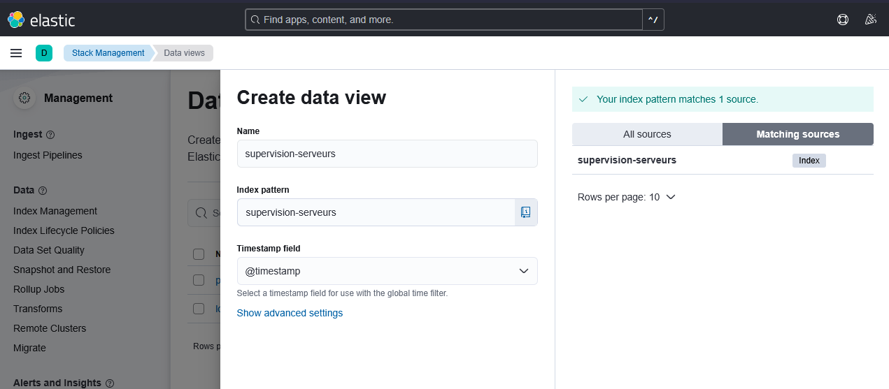

**Exploration Discover** :

- Requête KQL n°1 : `statut: "critique"` → 3 cas pour des jobs batch bloqués, des espaces dique proche de saturation et des pic CPU
- Requête KQL n°2 : `role: "web" and cpu_percent > 70` → 2 itérations a surveiller
- Filtre cliquable testé : hostname is srv-db-01

<!-- 📷 IMAGE 2 : capture Discover montrant la requête KQL n°1 (statut: "critique") et ses résultats -->
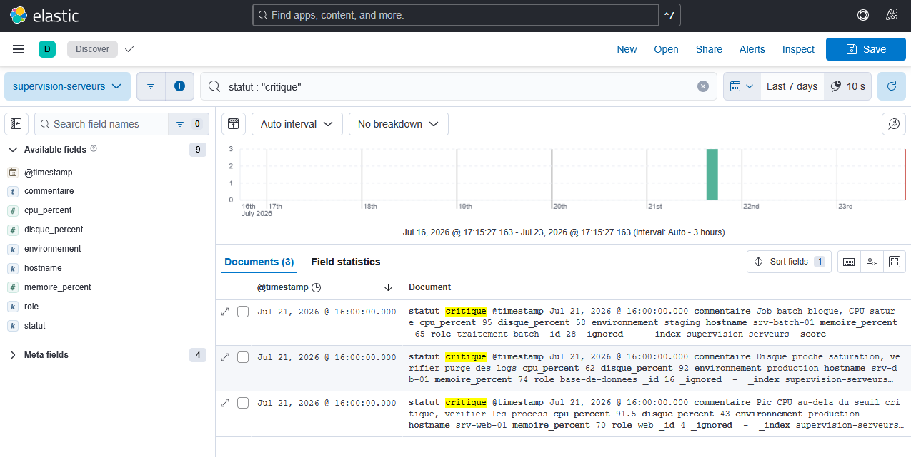

<!-- 📷 IMAGE 3 : capture Discover montrant la requête KQL n°2 (role: web and cpu_percent > 70) -->
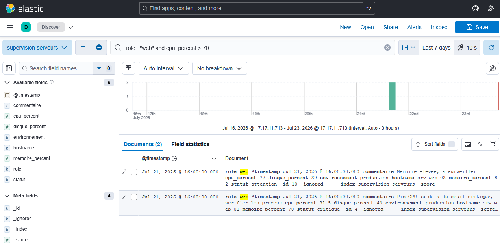

<!-- 📷 IMAGE 4 : capture Discover montrant le filtre cliquable appliqué (le "chip" de filtre visible en haut) -->
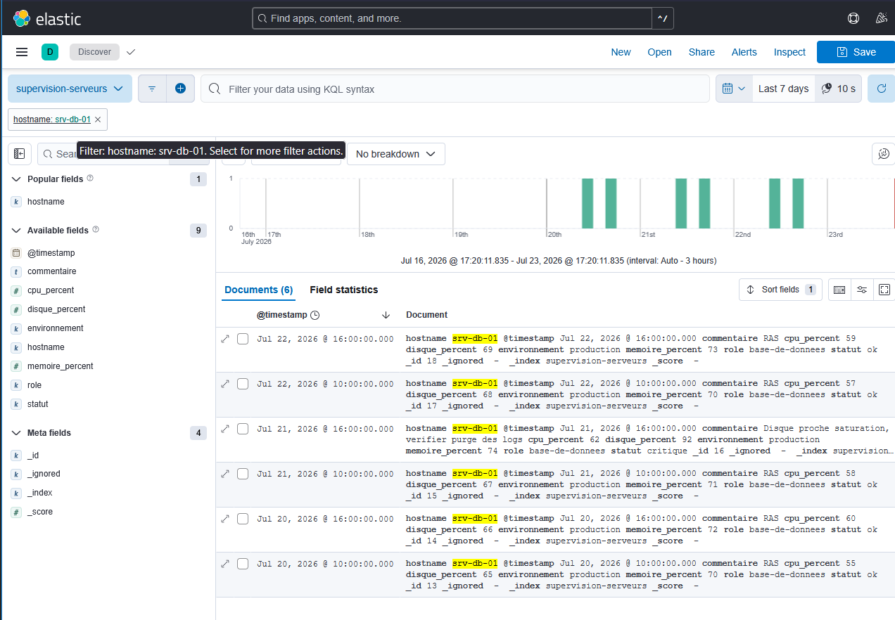

---

## 5. Visualisations

*(au moins 3, parmi pie/donut, bar, line, metric, table)*

### Visualisation 1 : Répartition par statut (pie/donut)

Bucket : Split slices → Terms → `statut`.

<!-- 📷 IMAGE 5 : capture de la visualisation "Répartition par statut" -->
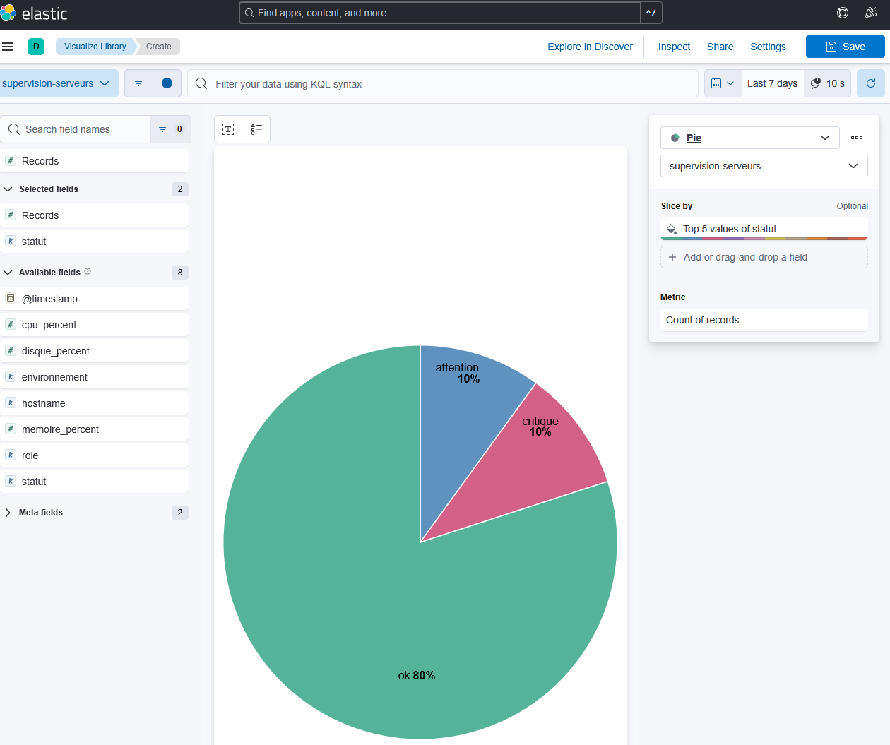

### Visualisation 2 : CPU moyen par serveur (bar)

Bucket : X-axis → Terms → `hostname` ; Metric : Average → `cpu_percent`.

<!-- 📷 IMAGE 6 : capture de la visualisation "CPU moyen par serveur" -->
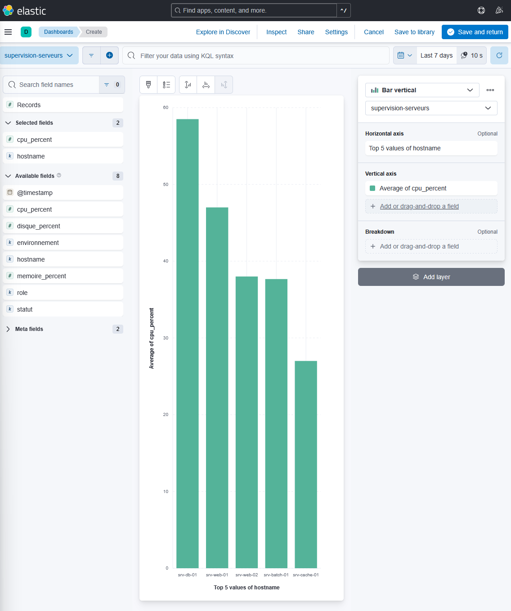

### Visualisation 3 : Évolution du CPU dans le temps (line)

Bucket : X-axis → Date Histogram → `@timestamp` ; Metric : Average → `cpu_percent`.

<!-- 📷 IMAGE 7 : capture de la visualisation "Évolution CPU dans le temps", pics visibles aux dates des relevés critique/attention -->
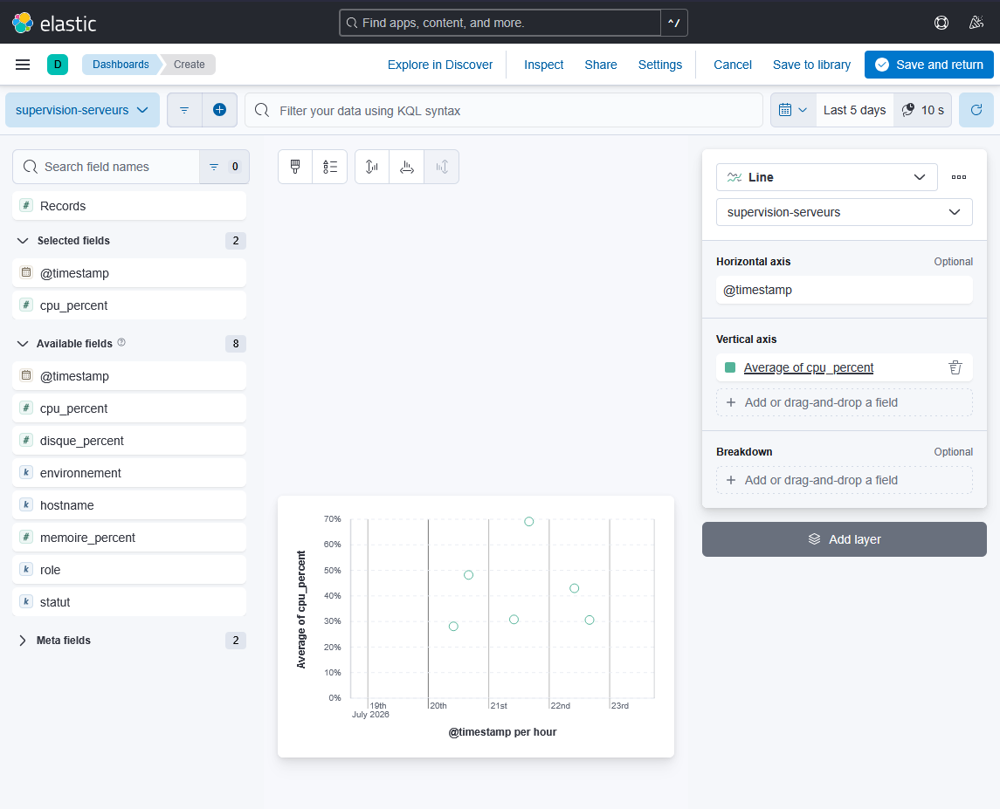

### (Optionnel) Visualisation 4 : Nombre de serveurs en critique (metric)

<!-- 📷 IMAGE 8 (optionnelle) : capture de la visualisation "metric" nombre de relevés critiques -->
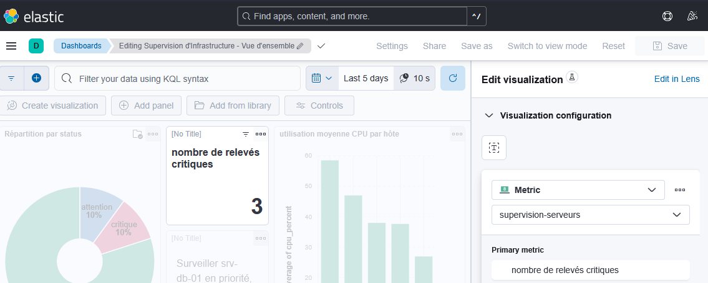

---

## 6. Dashboard

 Supervision infrastructure — vue d'ensemble

<!-- 📷 IMAGE 9 : capture du dashboard complet, tous les panels visibles, y compris le panel Markdown de contexte -->
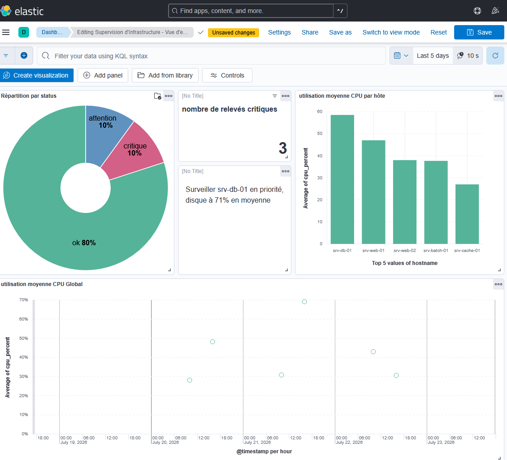

**Filtre global testé** : `environnement: production` appliqué en haut du dashboard.

<!-- 📷 IMAGE 10 : capture du dashboard AVEC le filtre global environnement:production actif, montrant les panels recalculés -->
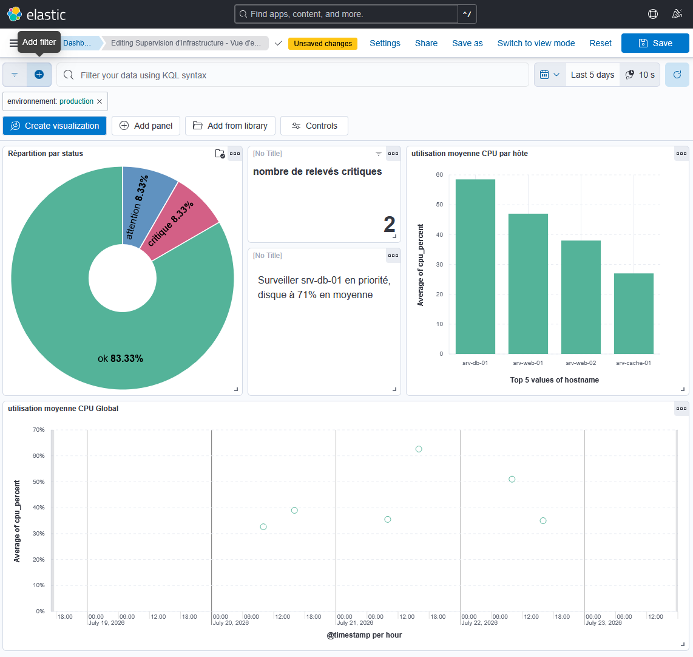

**Interaction / drill-down testée** : clic sur un bucket (ex. part `critique` du pie chart) filtrant les autres panels.

<!-- 📷 IMAGE 11 : capture du dashboard juste après le clic sur le bucket "critique", montrant l'effet sur les autres panels -->
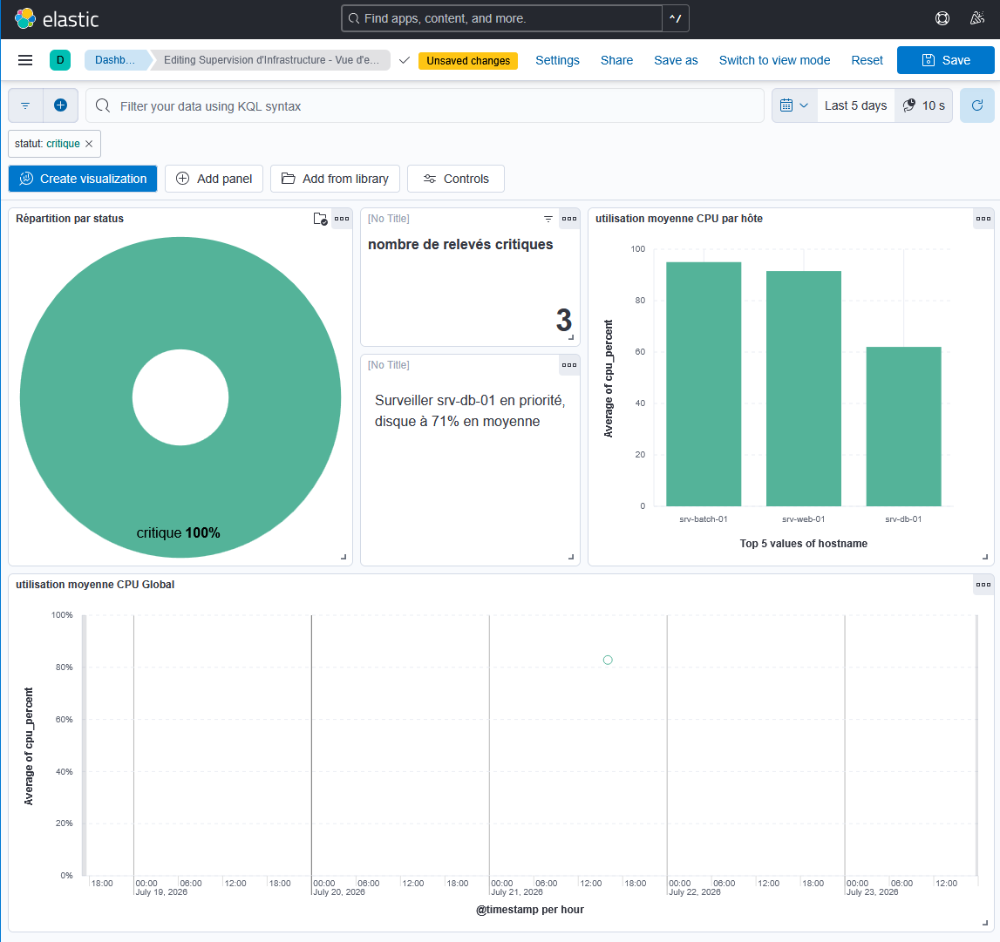

**Différence observée entre les deux** : le filtre global (image 10) est ajouté manuellement par toi et reste actif tant qu'il n'est pas retiré, alors que l'interaction (image 11) vient d'un clic direct sur un panel et est plus ponctuelle/exploratoire — dans les deux cas Kibana recalcule tous les panels du dashboard, mais l'origine et la persistance diffèrent.

---

## 7. Administration

### Index Management

<!-- 📷 IMAGE 12 : capture de Stack Management → Index Management, ligne "supervision-serveurs" visible
     avec health, docs count, storage size -->
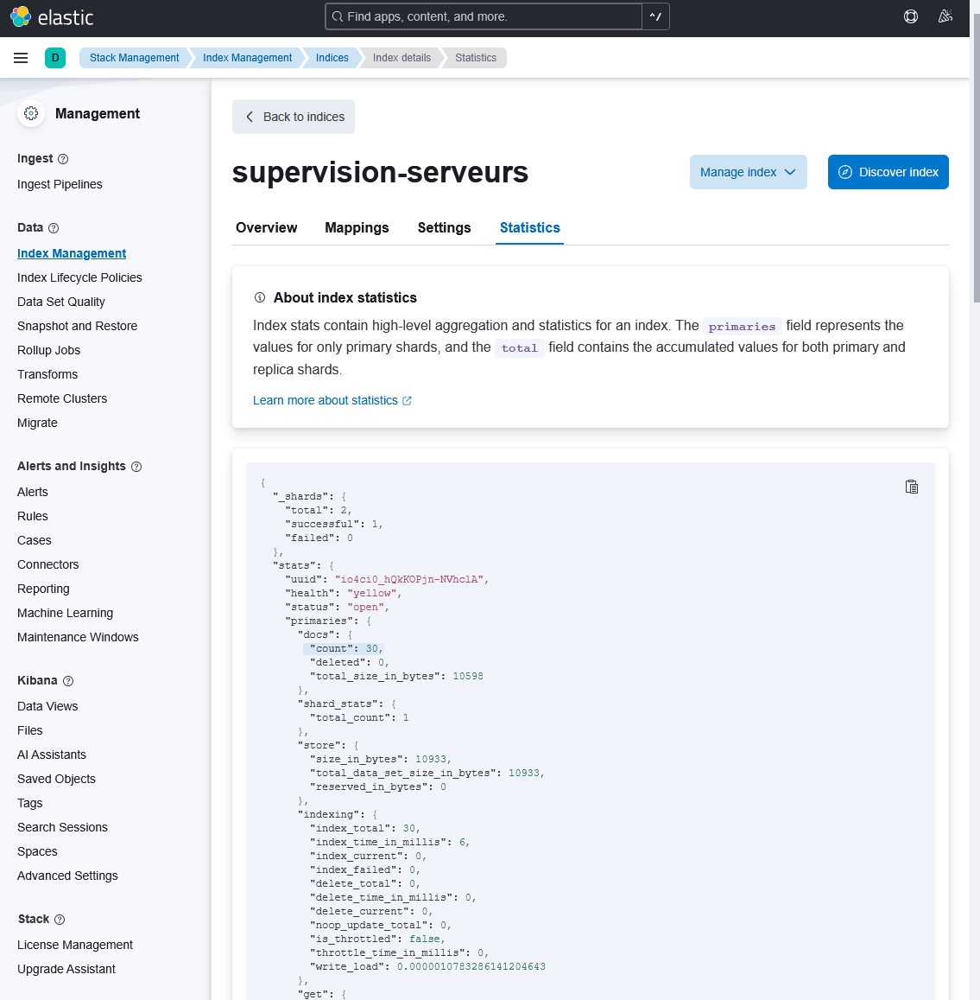

Relevés :
- Health : yellow
- Docs count : 30, attendu 30
- Storage size : 10598 octets

### Policy ILM

**Nom de la policy** : `supervision-serveurs-policy`.

Phases configurées : **Hot** (rollover — 30 jours ) et **Delete** ( 90 jours ).

<!-- 📷 IMAGE 13 : capture de la policy ILM créée, Stack Management → Index Lifecycle Policies,
     montrant les phases Hot et Delete configurées -->
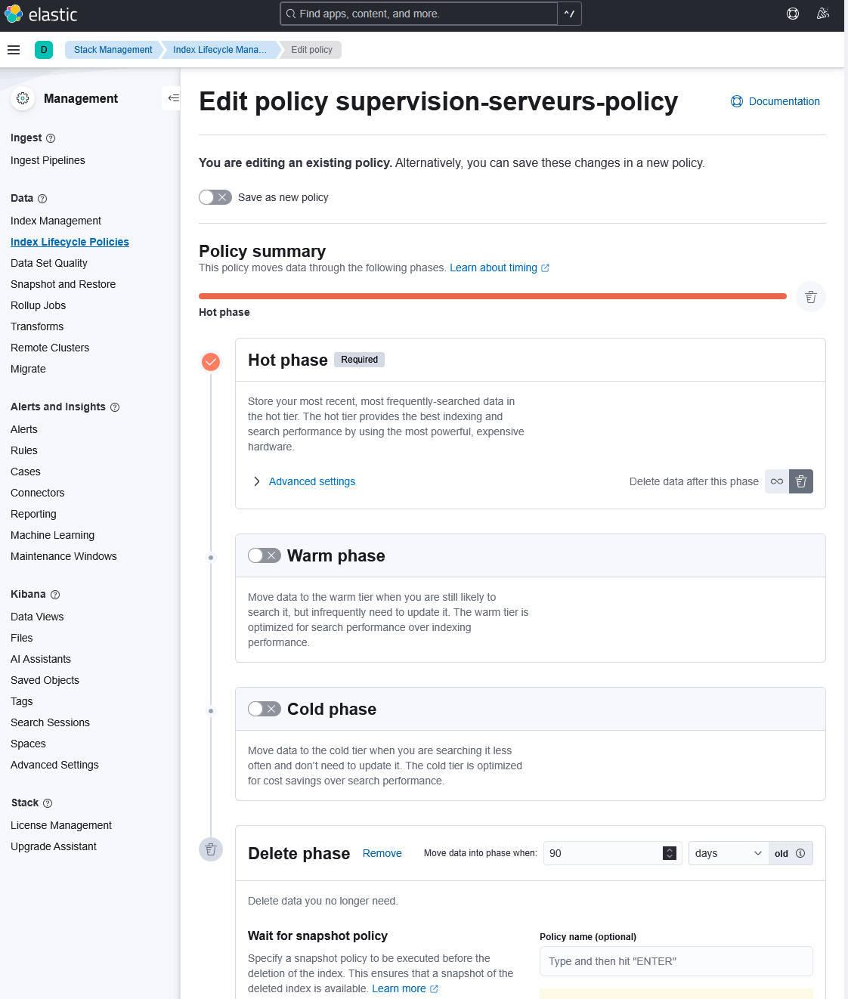

**Pourquoi ces phases** :un index de supervision alimenté en continu grossit indéfiniment sans intervention ; Hot+rollover gère la taille de l'index actif, Delete purge les données trop anciennes pour éviter une croissance illimitée.

---

## 8. Bilan

- ✅ Mapping explicite vérifié et conforme.
- ✅ 5 requêtes Query DSL exécutées et documentées (`requetes.md`).
- ✅ 4 agrégations exécutées et documentées (`requetes.md`).
- ✅ Data view + Discover explorés.
- ✅ 3+ visualisations créées et assemblées en dashboard.
- ✅ Filtre global et interaction testés.
- ✅ Index Management consulté.
- ✅ Policy ILM créée (Hot + Delete).
